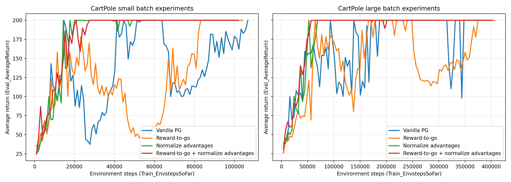
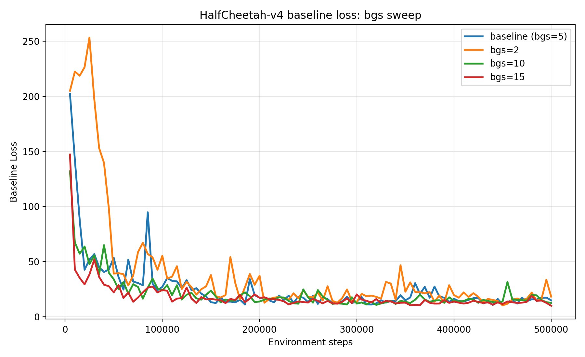
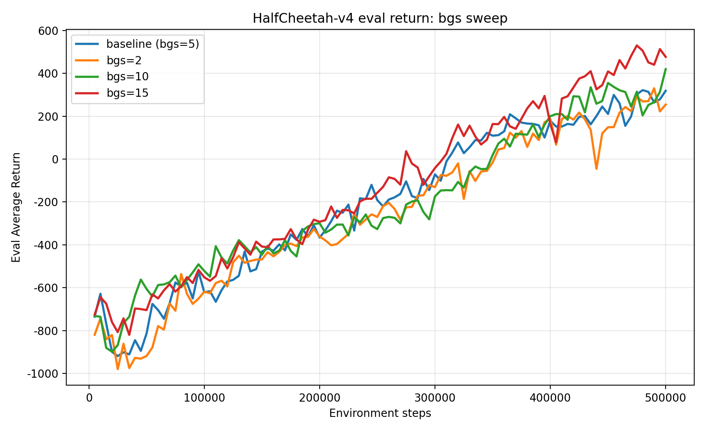
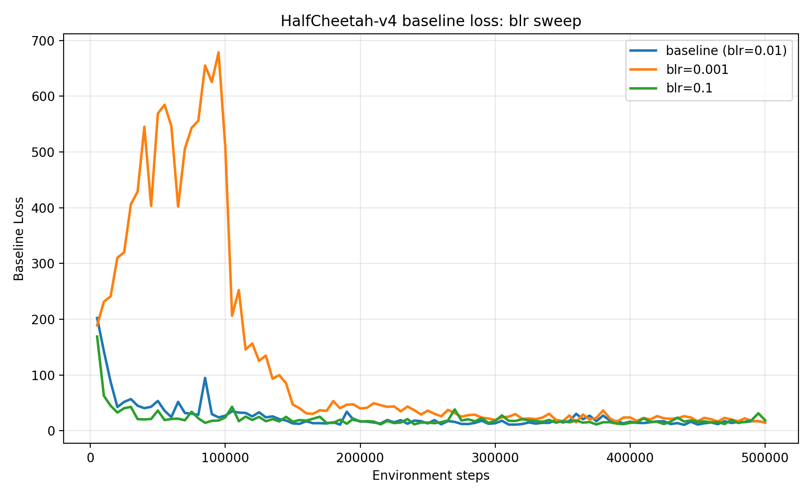
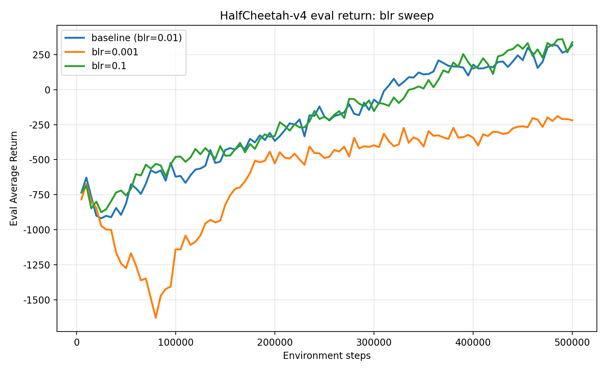
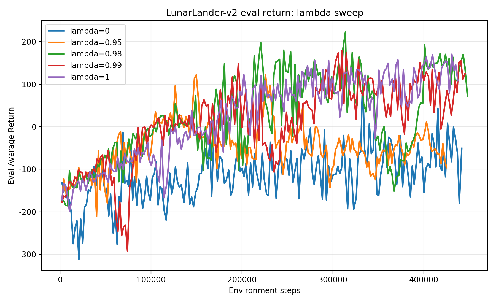

# 1. CartPole
## Training Curves

## Discussion
1. Without normalization, the reward-to-go estimator has better performance than the trajectory-centric estimator. The reward-to-go estimator is more stable and has lower variance compared to the trajectory-centric estimator.
2. With normalization, the two estimators have similar performance. Normalization helps to reduce the variance of the advantage estimates, which can improve the stability of training for both estimators.
3. The advantage normalization has a significant impact on the performance of the policy gradient algorithm. Normalization helps to stabilize training by reducing the variance of the advantage estimates, which can lead to faster convergence and better overall performance.
4. Large batch size make the training curves a little smoother, while I think its impact is less than the advantage normalization. 

# 2. HalfCheetah
## Training Curves

## Discussion
For the baseline gradient-step sweep(`bgs`), increasing the number of critic updates generally improved both the baseline fit and the policy performance. **This is consistent with the critic being trained more thoroughly, which gives lower-variance advantage estimates and a better policy gradient update.**

For the baseline learning-rate sweep(`blr`), decreasing the baseline learning rate too much clearly hurt training. With `blr=0.001`, the baseline loss stayed almost flat around 15 and the eval return remained negative throughout training, finishing near -219. In contrast, the default `blr=0.01` learned a useful baseline and reached a final eval return around 319. A larger learning rate, `blr=0.1`, was somewhat noisier in the loss curve but still trained a competitive policy, finishing around 339. **Overall, for this experiment an under-trained critic was much more damaging than a somewhat aggressive critic optimizer.**

# 3. LunarLander
## Training Curves

## Discussion
The value of $\lambda$ had a clear effect on LunarLander performance. The intermediate settings gave the best tradeoff: `lambda=0.98` achieved the highest peak return at about 223, while `lambda=0.99` and `lambda=1` also crossed 150 at least once and ended with stronger returns than the smaller-$\lambda$ runs. 

By comparison, `lambda=0` never exceeded 150 and `lambda=0.95` also failed to meet that threshold, suggesting that too much bootstrapping introduced enough bias to slow or destabilize learning on this task.

- `lambda=0` corresponds to **a one-step TD-style advantage estimate**, which has low variance but high bias because it relies heavily on the learned value function. 
- `lambda=1` corresponds to **the Monte Carlo reward-to-go estimate**, which has low bias but higher variance. 

The LunarLander results match the usual bias-variance tradeoff: a moderate value such as `0.98` or `0.99` worked best because it retained some variance reduction from bootstrapping without becoming as biased as the `lambda=0` setting.

# 4. InvertedPendulum
It's a little dirty, and I try some settings. :-(